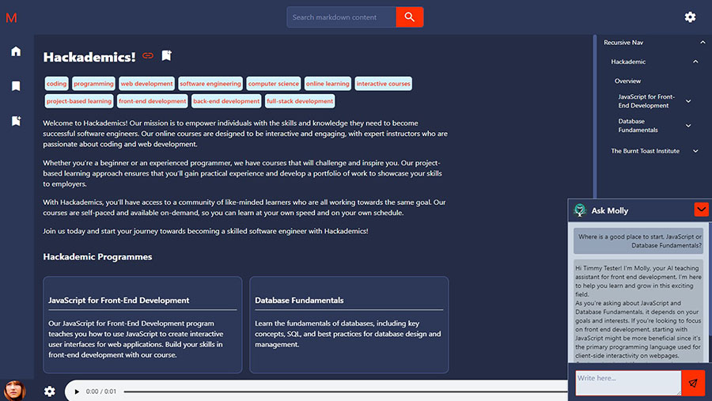

# About

Mollify is a dynamic Learning Management System (LMS) designed to provide a user-friendly interface for managing and navigating markdown content. The platform offers a multitude of features, including content navigation, search capabilities, bookmarking, text-to-speech functionality, an AI assistant, and a markdown editor with 'What You See Is What You Get' (WYSIWYG) capabilities.

Mollify is divided into various packages within a Lerna monorepository, primarily consist of the LMS and CLI. These modules empower users to manage their content efficiently and transform it into a navigable webpage.
