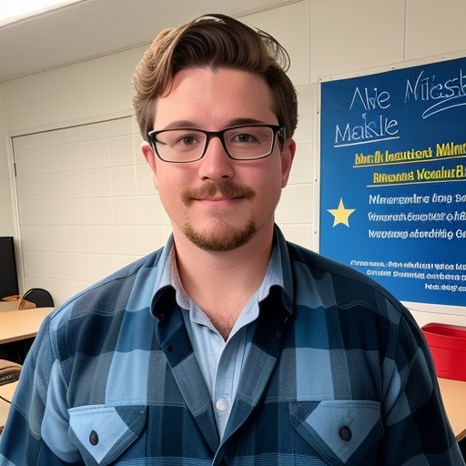
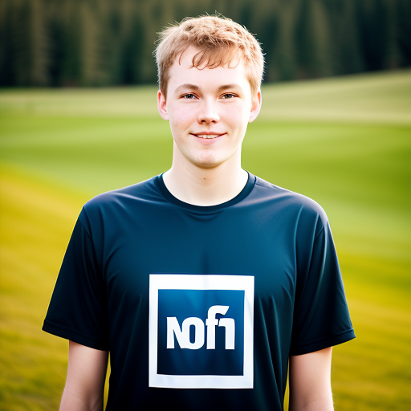
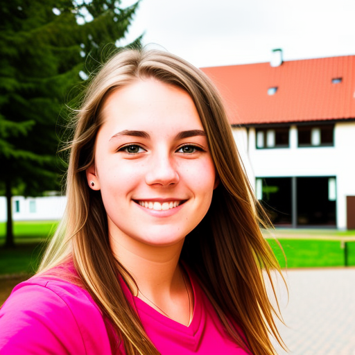
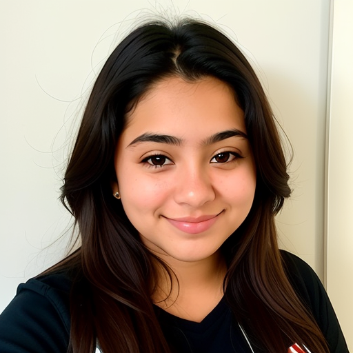
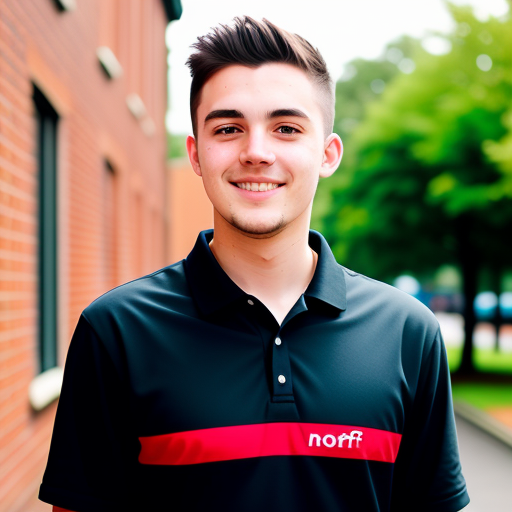
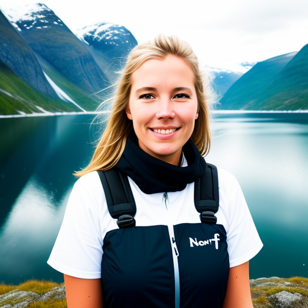
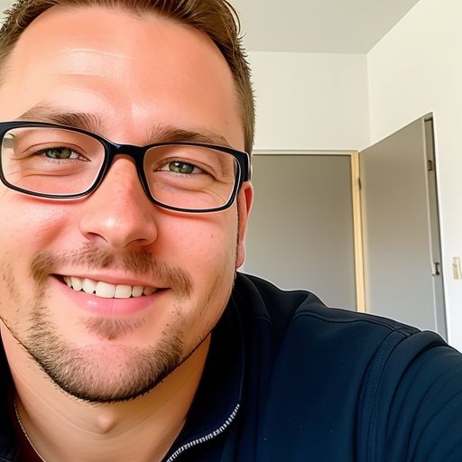

<table>
  <tr>
    <td>

<strong>Name:</strong> Jackson "Jax" McKenzie 
<strong>Location:</strong> South Africa 
<strong>Title:</strong> Front-end Development Coach at Noroff 

Hi, my name is Jackson McKenzie, but my friends call me Jax. I'm a Front-end Development Coach at Noroff, and I love sharing my coding knowledge through fun and engaging videos. When I'm not creating content, you can find me playing my favorite video games.

</td>
    <td>

<strong>Name:</strong> Trevor Strauss 
<strong>Location:</strong> South Africa 
<strong>Title:</strong> Front-end Development Coach at Noroff 

I'm Trevor Strauss, a Front-end Development Coach at Noroff. I specialize in comprehensive written material and academic-style instruction. Although I love teaching, I also work as a fireman.

</td>
  </tr>
  <tr>
    <td>

<strong>Name:</strong> Ole Henrik Johansen 
<strong>Location:</strong> Norway 
<strong>Title:</strong> Front-end Development Student at Noroff 

I'm Ole Henrik Johansen, a full-time student at Noroff, dedicated to mastering the art of front-end development. I thrive in code-focused projects and love collaborating with my fellow students to create innovative solutions.

</td>
    <td>

<strong>Name:</strong> Annika Müller 
<strong>Location:</strong> Germany 
<strong>Title:</strong> Front-end Development Student at Noroff 

My name is Annika Müller, and I'm a part-time front-end development student at Noroff from Germany. With a background in UX design, I emphasise the importance of aesthetics and enjoy collaborating with my peers on design-focused projects. My coding skills are a work in progress, but my design expertise is invaluable.

</td>
  </tr>
  <tr>
    <td>

<strong>Name:</strong> Camila Ortega 
<strong>Location:</strong> Ecuador 
<strong>Title:</strong> Front-end Development Student at Noroff 

I'm Camila Ortega, a full-time front-end development student at Noroff from Ecuador. Known for my strong work ethic and self-motivation, I excel in solo projects. Despite my intermediate English skills, I am dedicated to my studies and eager to improve my language proficiency.

</td>
    <td>

<strong>Name:</strong> Oliver Harrison 
<strong>Location:</strong> UK 
<strong>Title:</strong> Front-end Development Student at Noroff 

I'm Oliver Harrison, a full-time front-end development student at Noroff, based in the UK. As a small business owner, my primary goal is to enhance my understanding of front-end development in order to better manage my business. I have no plans to pursue a career in the field but value the knowledge I gain.

</td>
  </tr>
  <tr>
    <td>

<strong>Name:</strong> Ingrid Andersen 
<strong>Location:</strong> Norway 
<strong>Title:</strong> Content Editor at Noroff 

My name is Ingrid Andersen, and I'm a content editor at Noroff. I'm known for my impeccable punctuality and sharp attention to detail. Fluent in multiple languages, I bring a unique perspective to my editing work, ensuring that all content meets the highest standards.

</td>
    <td>

<strong>Name:</strong> Willem de Vries 
<strong>Location:</strong> Netherlands 
<strong>Title:</strong> Front-end Development Programme Manager at Noroff 

I'm Willem de Vries, the Front-end Development Programme Manager at Noroff, based in the Netherlands. As an avid reader, I'm always exploring new ideas and concepts related to my field. My diplomatic approach has helped me successfully manage a diverse team, even though I'm often very busy juggling multiple responsibilities.

</td>
  </tr>
</table>

